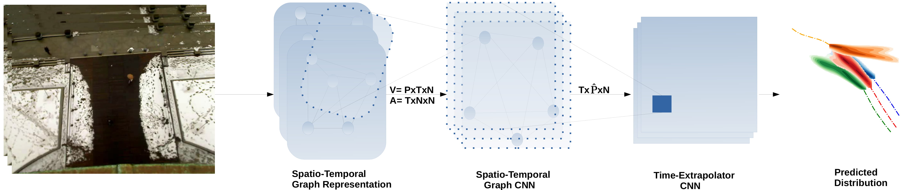
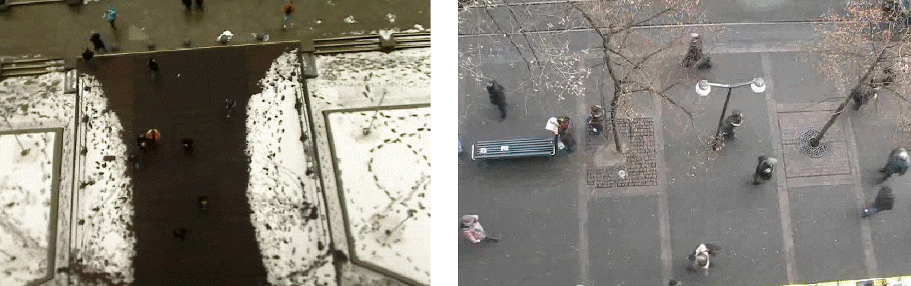

# Social-STGCNN: A Social Spatio-Temporal Graph Convolutional Neural Network for Human Trajectory Prediction
### Abduallah Mohamed, Kun Qian <br />
### Mohamed Elhoseiny** , Christian Claudel**
##### <sup>**</sup> Equal advising
Read full paper <a href="https://arxiv.org/abs/2002.11927">here</a>, Presented at [CVPR 2020](http://cvpr2020.thecvf.com/)

### Social-STGCNN
<div align='center'>
</img>
</div>
<br />

We propose the Social Spatio-Temporal Graph Convolutional Neural Network (Social-STGCNN), which models the problem of human trajectory prediction as a spatio-temporal graph. Our results show an improvement over the state of art by 20\% on the Final Displacement Error (FDE) and an improvement on the Average Displacement Error (ADE) with 8.5 times less parameters and up to 48 times faster inference speed than previously reported methods. In addition, our model is data efficient, and exceeds previous state of the art on the ADE metric with only 20\% of the training data. We propose a kernel function to embed the social interactions between pedestrians within the adjacency matrix.

Our model inference speed is 0.002s/frame (500Hz) using only 7.6K parameters.
### Citaion
You can cite our paper using: 
```
@InProceedings{Mohamed_2020_CVPR,
author = {Mohamed, Abduallah and Qian, Kun and Elhoseiny, Mohamed and Claudel, Christian},
title = {Social-STGCNN: A Social Spatio-Temporal Graph Convolutional Neural Network for Human Trajectory Prediction},
booktitle = {IEEE/CVF Conference on Computer Vision and Pattern Recognition (CVPR)},
month = {June},
year = {2020}
}
```


#### Model
<div align='center'>
</img>
</div>
<br />
Social-STGCNN model consists of 2 building blocks: <br />
1- ST-GCNN: A Spatio-Tempral Graph CNN that creates a spatio-temporal graph embedding representing the previous pedestrians trajectories. <br />
2- TXP-CNN: A Time-Extrapolator CNN that utilizes the spatio-temporal graph embedding to predict future trajectories.<br />

More details are in this description video:<br /> 
<div align='center'>
  
[](https://www.youtube.com/watch?v=Yi9rVHJM8WY)
</div>

#### Predictions sample

<div align='center'>
</img>
</div>
<br />

### Setup: 
The code was written using python 3.6. 
The following libraries are the minimal to run the code: 
```python
import pytorch
import networkx
import numpy
import tqdm
```
or you can have everything set up by running: 
```bash
pip install -r requirements.txt
```
### Using the code:
To use the pretrained models at `checkpoint/` and evaluate the models performance run:
```bash
test.py
```

To train a model for each data set with the best configuration as in the paper, simply run:
```bash
./train.sh  
```
Please note: The initiation of training and testing might take a while as the code creates a cache to store the spatio-temporal graphs.
<br />
Exact CVPR version: https://github.com/abduallahmohamed/Social-STGCNN/tree/ebd57aaf34d84763825d05cf9d4eff738d8c96bb
